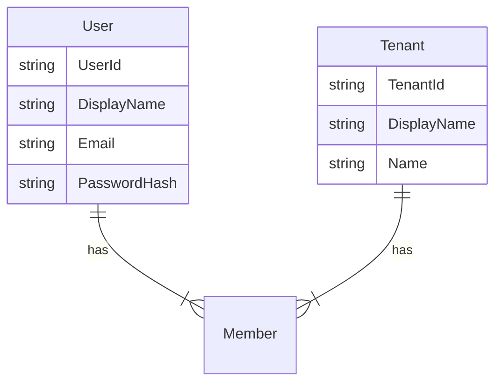

# Primary Keys

Entity | Primary Key       | Sort Key               | Description
------ | ----------------- | ---------------------- | -----------
User   | `USER#<userId>`   | `#METADATA#<userId>`   | A user that can auth against the system
Tenant | `TNNT#<tenantId>` | `#METADATA#<tenantId>` | A tenant in the application
Member | `TNNT#<tenantId>` | `USER#<userId>`        | A user assigned to a tenant

# Access Patterns

- Create user (Write)
- Create tenant (Write)
- View users in tenant (Read)
- Add user to a tenant (Write)